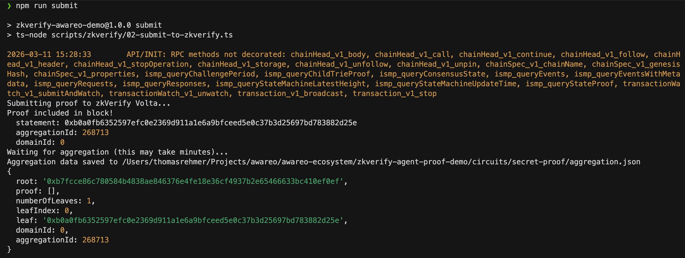
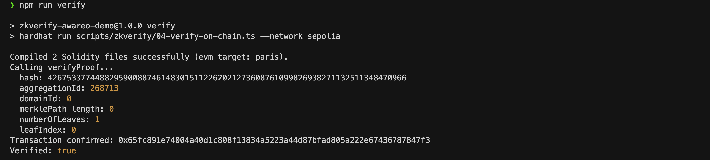

# zkVerify Agent Proof Demo

Minimal example exploring how automated agents can prove authorization using zero-knowledge proofs and zkVerify.

As software systems become increasingly agentic, autonomous agents start executing real actions such as:

- publishing content
- triggering workflows
- interacting with smart contracts

This raises a fundamental question:

**How can a system verify that an agent is actually allowed to perform an action?**

Today this is usually handled through API keys, roles, or service identities.
However, these mechanisms rely on trust in the agent's identity.

Instead, a system could require a **cryptographic proof of authorization**.

This repository demonstrates a minimal pattern where an agent proves it belongs to an authorized set without revealing its identity or credentials, using zero-knowledge proofs and zkVerify.

---

## Concept

The example shows how an agent can generate a proof and have it verified through zkVerify aggregation before a smart contract accepts the action.

```
Agent (user secret)
 │
 ▼
Circom Circuit
 │
 ▼
Groth16 Proof (snarkjs)
 │
 ▼
zkVerify Volta
 │
 │  aggregation
 ▼
Merkle Tree
 │
 ▼
Ethereum Sepolia
 │
 ▼
zkVerify Proxy Contract
 │
 ▼
ZkVerifyTest.sol
 │
 ▼
verified[agent] = true
```

Instead of verifying every proof individually on-chain, zkVerify aggregates multiple proofs into a Merkle tree.

The smart contract only verifies that a proof belongs to this aggregated result, significantly reducing the on-chain verification workload.

---

## Example Use Case

Consider an automated content pipeline:

```
Research Agent → Writing Agent → Editing Agent → Publishing Agent
```

The final publishing step is critical.

Instead of trusting the agent identity, the system could require a proof that the agent belongs to the authorized publisher set.

The publishing action would only execute if the proof is valid.

This repository demonstrates a simplified version of this pattern using zkVerify.

---

## Stack

| Component | Technology |
|-----------|-----------|
| Circuit Language | Circom 2.1.6 |
| Proof System | Groth16 (bn128 curve) |
| Proving Library | snarkjs |
| Hash Function | Poseidon |
| zkVerify SDK | zkverifyjs |
| Smart Contracts | Solidity 0.8.24 (Hardhat) |
| Target Chain | Ethereum Sepolia |
| zkVerify Network | Volta Testnet |

---

## Deployed Contract

The verifier contract is deployed and verified on Sepolia with **18 successful on-chain proof verifications**.

| | |
|---|---|
| **Contract** | [`0xF1F86d977e787b895D059C65dE649AeF9703902f`](https://sepolia.etherscan.io/address/0xF1F86d977e787b895D059C65dE649AeF9703902f) |
| **VKey Hash** | `0x8aead396c3c6ba98d0fc38d041ed8e744e71957415571ca5990c72c7b4b7e6cf` |
| **Network** | Ethereum Sepolia |
| **Source** | Verified on Etherscan (Solidity 0.8.24) |

> No need to redeploy unless you modify the circuit or contract logic. The existing contract and VKey hash work out of the box.

---

## Requirements

To run the demo you need a wallet with testnet tokens.

> ⚠️ Use a test wallet only. Never commit your private key.

### 1. Wallet

Add your wallet credentials to the `.env` file:

```
TESTNET_PRIVATE_KEY=0x...         # Sepolia transactions
ZKVERIFY_SEED_PHRASE="word1 ..."  # zkVerify Volta submissions
```

### 2. zkVerify Volta Tokens (tVFY)

Required to submit proofs to zkVerify.

Faucet: [faucy.com/zkverify-volta](https://www.faucy.com/zkverify-volta)

### 3. Sepolia ETH

Required for on-chain verification transactions.

Faucet: [sepoliafaucet.com](https://sepoliafaucet.com)

---

## Quick Demo

```bash
npm install
cp .env.example .env
```

Fill in:
- `ZKVERIFY_SEED_PHRASE`
- `TESTNET_PRIVATE_KEY`

Then run:

```bash
# 1. Submit proof to zkVerify Volta and wait for aggregation
npm run submit

# 2. Confirm the VKey hash matches the deployed contract
npm run zkverify:get-vkey-hash

# 3. Verify proof inclusion on-chain
npm run verify
```

After successful verification: `verified[signer] = true`

### Demo Output

**1. Submit proof to zkVerify Volta**



**2. Confirm VKey hash**


**3. On-chain verification**



---

## Repository Structure

```
zkverify-agent-proof-demo/
├── circuits/
│   └── secret-proof/
│       ├── circuit.circom              # Circom authorization circuit
│       └── input.json                  # Example input
├── contracts/
│   └── zkverify/
│       ├── interfaces/
│       │   └── IVerifyProofAggregation.sol
│       └── ZkVerifyTest.sol            # On-chain verifier
├── scripts/
│   └── zkverify/
│       ├── compute-hash.js             # Poseidon hash helper
│       ├── 02-submit-to-zkverify.ts    # Submit proof to zkVerify Volta
│       ├── 02b-get-vkey-hash.ts        # Get VKey hash
│       ├── 03-deploy-verifier.ts       # Deploy contract to Sepolia
│       └── 04-verify-on-chain.ts       # On-chain verification
├── .env.example
├── hardhat.config.ts
├── package.json
└── tsconfig.json
```

---

## Real World Integration

In production environments, proof generation typically runs server-side.

Users interact with the application normally while the backend:
- generates the proof
- submits it to zkVerify
- verifies inclusion on-chain when required

This allows applications to integrate zero-knowledge proofs without exposing users to blockchain complexity.

---

## Related Experiments

[OpenClaw Marketing Agent](https://github.com/thomasbln/openclaw-marketing-agent)

[GraphRAG Legal Demo](https://github.com/thomasbln/graphrag-legal-demo)

---

## License

MIT

---

crafted by [thomas](https://medium.com/@thomasbln) @ [awareo.io](https://awareo.io)
